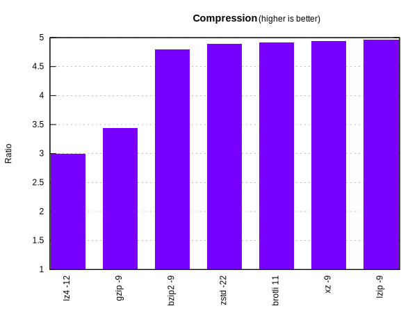
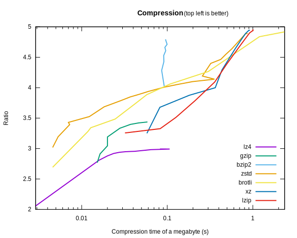
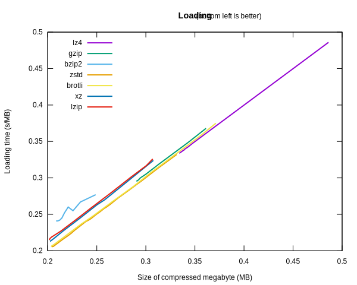
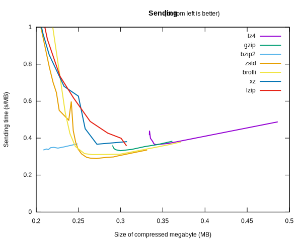

# Compressor benchmark

[Many][zstd benchmark] [benchmarks][mattmahoney] [focus][Lzip benchmark] on
intangible measurements, analyzing the relationship between compression speed
and ratio without providing intuition as to their real-world benefits.

(Notable improvements are the [LZ4 benchmark][LZ4] and [Squash][], but they are
either not as extensive or not as focused as this article.)

This benchmark aims to bridge that gap, while comparing the most widely deployed
compression schemes in the world.

## Aims

The motivation for compressing data mostly falls within three categories:

### 1. Size

You wish to reduce *disk, memory or network data use*. What you want to maximize
then is **compression ratio**: how big a megabyte of compressed data is, once
uncompressed. For instance, a ratio of 3 means that a 1 MB zip on disk stores 3
MB of content, effectively tripling the amount of disk space.

The winner there is **Lzip**, closely followed by **XZ**.

(Lzip and XZ contain the same compression algorithm, LZMA, which relies on
range encoding, a derivative of arithmetic coding, a compute-intensive method
that has very high compression power.)

Of course, storage costs may need to be balanced against CPU costs of running
compression. The faster the compression, the lower the CPU cost.

Assuming we have a constraint on both parameters computed as a linear
combination, it is representable as a line on the plot that “falls” from the top
right. If disk space is more important, the line will be closer to the
horizontal; if CPU is more relevant, it will be more vertical.
(That said, [storage costs usually dominate][jdlm].)

A line that is going up is not optimal, so all positive slopes can be discarded.
If you imagine that line starting horizontal at the top, and slowly sloping
down, it will come into contact with various compressors, until it reaches a
vertical state.

That creates a convex hull around the compressors, corresponding to the best
choices for all weighted compromises between storage and CPU costs.

### 2. Loading

You want *fast downloads*. To truly shine there, you need to have previously
compressed the files to disk once. The time needed to get the file loaded from
the server to your client is the sum of two pieces: first, you need to
transfer the compressed zip, then the client needs to extract it.

Your hope is that the time won by transfering less bytes will more than make up
for the time lost by extracting them.

         Transfer 1 MB of raw data at 1 MB/s
    ┌───────────────────────────────────────────┐
    └───────────────────────────────────────────┘
    └──────────────── 1 second ─────────────────┘

      Transfer (1÷ratio) MB   Extract 1 MB
    ┌───────────────────────┬──────────────┐
    └───────────────────────┴──────────────┘
    └──────── 203 ms ───────┴──── 3 ms ────┘

Usually, for a given algorithm, the **decompression speed** (the number of
megabytes decompressed every second) is the same regardless of the compression
level (ie, how viciously the compressor tried to reduce the size of the file).
So the extraction time is a constant of the raw data size.

Therefore, you always get linearly higher download speeds with higher
compression levels. You want to compare compression software only between the
flags that yield the highest ratio.

The winner in this field seems to be Zstandard and Brotli, with XZ and Lzip not
far behind (in this order).

(At least, at 1 MB/s. As network bandwidth grows closer to the decompression
speed, the bottleneck becomes decompression. Past a certain point, the
compressors get slower than sending data without compression, and you need
compressors with much higher decompression speeds, like Zstandard and LZ4, to
compete.)

### 3. Sending

If you are looking for the *fastest transfer time*, and you don't want to keep
the compressed version, you may be able to gain a little extra transfer speed by
compressing the file first, if the network bandwidth is not too fast.

To compute this, we add the time it takes to compress the file to the loading
time we computed previously.

At 1 MB/s, when the sending time (compression + transfer + extraction) per
megabyte takes more than 1 second, we are better off sending the raw file.

Unlike the decompression speed, the **compression speed** slows linearly with
the compression level. As a result, the sending time is a U curve over
compression levels, for any given compressor.

The winner seems to be Zstandard -6, with Brotli -5 not far behind twenty
milliseconds later. Gzip -5 is relevant again 20 milliseconds later, closely
followed by bzip2. XZ and Lzip are many tens of milliseconds slower than the
rest even at the lowest compression level.

The big surprise is bzip2. With its consistently high compression speed, it
remains competitive throughout its levels. If you are ready to compromise
a tiny bit of transfer time to gain space, you can transmit one more megabyte
for each megabyte transmitted.

## Compression utilities

I chose tools that were ❶ readily available, ❷ [popular][Google Trends], and ❸
address various segments of the Pareto frontier.

<table>
  <tr><th> Name <th> Algorithm                   <th> Related archivers
  <tr><td><a href='https://www.gzip.org/'>gzip</a>
                <td> DEFLATE (LZSS, Huffman)     <td> ZIP, PNG
  <tr><td><a href='http://sourceware.org/bzip2/'>bzip2</a>
                <td> BWT, MTF, RLE, Huffman      <td>
  <tr><td><a href='https://tukaani.org/xz/'>XZ</a>
                <td> LZMA (LZ77, range encoding) <td> 7-Zip
  <tr><td><a href='https://www.nongnu.org/lzip/lzip.html'>Lzip</a>
                <td> LZMA (LZ77, range encoding) <td> 7-Zip
  <tr><td><a href='https://github.com/google/brotli/blob/master/README.md'>Brotli</a>
                <td> LZ77, Huffman, context modeling <td> WOFF2
  <tr><td><a href='https://lz4.github.io/lz4/'>LZ4</a>
                <td> LZ77                        <td>
  <tr><td><a href='https://facebook.github.io/zstd/'>Zstandard</a>
                <td> LZ77, tANS, Huffman         <td>
</table>

## Caveats

- A given algorithm cannot compress all inputs to a smaller size. In particular,
  already-compressed inputs (such as images) might actually compress to a bigger
  file.
- Certain implementations may make use of CPU-dependent optimizations that can
  improve their performance on other devices.

[zstd benchmark]: https://raw.githubusercontent.com/facebook/zstd/master/doc/images/DCspeed5.png
[mattmahoney]: http://mattmahoney.net/dc/text.html
[Lzip benchmark]: https://www.nongnu.org/lzip/lzip_benchmark.html
[Squash]: https://quixdb.github.io/squash-benchmark/
[jdlm]: https://jdlm.info/articles/2017/05/01/compression-pareto-docker-gnuplot.html
[Google Trends]: https://trends.google.com/trends/explore?cat=32&date=today%205-y&q=%2Fm%2F03bzt,%2Fm%2F0hjcb,%2Fm%2F063ynsr,%2Fg%2F11c1p5xyz2,%2Fm%2F011v70tt
[gzip]: https://www.gzip.org/
[bzip2]: http://sourceware.org/bzip2/
[XZ]: https://tukaani.org/xz/
[Lzip]: https://www.nongnu.org/lzip/lzip.html
[Brotli]: https://github.com/google/brotli/blob/master/README.md
[LZ4]: https://lz4.github.io/lz4/
[Zstandard]: https://facebook.github.io/zstd/
